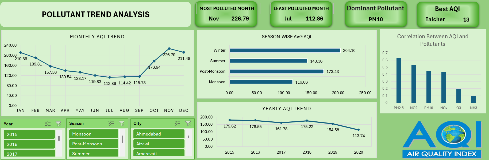
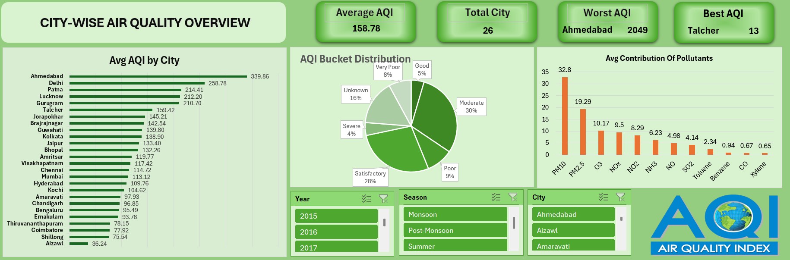

<div align="center">

# 🌍 Air Quality Index (AQI) Analytics Dashboard

<p align="center">
  <b>An interactive Microsoft Excel Business Intelligence system analyzing 5 years of daily pollution metrics across 26 major Indian cities</b>
</p>

[](https://www.microsoft.com/en-us/microsoft-365/excel)
[](https://github.com/jadavharsh109/AQI-dashboard-Excel-)
[](https://github.com/jadavharsh109/AQI-dashboard-Excel-)
[](https://www.linkedin.com/in/harshjadav0901/)
[](LICENSE)

</div>

---

### ⚡ Executive KPI Summary

| 🏙️ Cities Monitored | 📅 Time Horizon | 📊 Total Records | 🧪 Parameters Tracked |
| :---: | :---: | :---: | :---: |
| **26 Major Indian Cities** | **5 Years (2015–2020)** | **29,531 Daily Observations** | **12 Key Pollutants** |

---

## 📑 Table of Contents
- [📌 Problem Statement & Objectives](#-problem-statement--objectives)
- [📁 Project Structure](#-project-structure)
- [🗄️ Dataset Metadata & Pollutant Taxonomy](#️-dataset-metadata--pollutant-taxonomy)
- [📊 Interactive Dashboard Showcase](#-interactive-dashboard-showcase)
  - [View 1: Pollutant Trends & Seasonality Analysis](#view-1-pollutant-trends--seasonality-analysis)
  - [View 2: City-wise Air Quality Overview & Rankings](#view-2-city-wise-air-quality-overview--rankings)
- [🔍 Key Empirical Insights](#-key-empirical-insights)
- [🛠️ Excel Techniques & Features Featured](#️-excel-techniques--features-featured)
- [🚀 How to Explore the Dashboard](#-how-to-explore-the-dashboard)
- [👨‍💻 Author & Connect](#-author--connect)

---

## 📌 Problem Statement & Objectives

Urban air pollution poses an immense public health and environmental crisis across Indian metropolitan centers. Rapid industrialization, seasonal agricultural burning, vehicular density, and meteorological inversions cause extreme fluctuations in air quality throughout the year.

This project transforms **29,500+ daily environmental observations** into an executive decision-support dashboard in Microsoft Excel to evaluate:
1. **Seasonal Patterns:** How do air quality indices fluctuate between harsh winter inversions and monsoon washout periods?
2. **Pollutant Attribution:** Which specific particulates ($PM_{2.5}, PM_{10}$) and toxic gases ($NO_2, SO_2, CO, O_3$) dominate the hazardous AQI thresholds?
3. **Geographic Disparities:** How do urban industrial hubs (e.g., Delhi, Ahmedabad) compare against greener zones over a multi-year horizon?

---

## 📁 Project Structure

```text
AQI-dashboard-Excel-/
├── assets/
│   ├── AQI_dash_1.png                                     # Dashboard view: Trends & pollutant contributions
│   └── AQI_dash_2.png                                     # Dashboard view: City-wise ranking & comparisons
├── dashboards/
│   └── Air Quality Index (AQI) Analysis Dashboard.xlsx    # Interactive Excel BI dashboard
├── data/
│   └── Raw_aqi_data.csv                                   # 29,531 daily records (26 cities, 2015–2020)
├── .gitignore                                             # Excel temp lock files & OS ignore rules
├── LICENSE                                                # MIT License
└── README.md                                              # Project documentation & visual tours
```

---

## 🗄️ Dataset Metadata & Pollutant Taxonomy

A compact, structured taxonomy of the 16 attributes tracked in `data/Raw_aqi_data.csv`:

| Chemical Category | Parameters Tracked | Primary Sources & Health Impact |
| :--- | :--- | :--- |
| **Particulate Matter** | `PM2.5`, `PM10` | Fine respirable dust from construction, vehicle exhaust & biomass burning. |
| **Nitrogen Oxides** | `NO`, `NO2`, `NOx`, `NH3` | Heavy vehicular traffic, fertilizer runoff & power plant combustion. |
| **Carbon & Sulfur** | `CO`, `SO2` | Incomplete combustion, coal-fired industrial plants & refineries. |
| **Photochemical Oxidants**| `O3` (Ground-level Ozone) | Secondary pollutant formed by sunlight reacting with $NO_x$ and VOCs. |
| **Volatile Organics (VOCs)**| `Benzene`, `Toluene`, `Xylene` | Petrochemical vapors, industrial solvents & vehicle refueling fumes. |
| **Index Categorization** | `AQI`, `AQI_Bucket` | Government CPCB standard index: Good, Satisfactory, Moderate, Poor, Very Poor, Severe. |

---

## 📊 Interactive Dashboard Showcase

### View 1: Pollutant Trends & Seasonality Analysis
Visualizes temporal trends, seasonal variance, and correlation between specific pollutants and overall AQI score.

<p align="center">
  
</p>

* **Interactive Controls:** Filter by Year (2015–2020), Season (Summer, Monsoon, Winter), and Specific City.
* **Monthly AQI Progression:** Demonstrates post-monsoon pollution build-up entering November.
* **Pollutant Contribution Chart:** Visual decomposition showing $PM_{10}$ and $PM_{2.5}$ as the primary drivers.

---

### View 2: City-wise Air Quality Overview & Rankings
Compares air quality performance across all 26 cities, mapping AQI bucket distributions and identifying outlier zones.

<p align="center">
  
</p>

* **City Ranking Matrix:** Highlights best vs. worst air quality metropolitan centers.
* **AQI Bucket Distribution:** Proportional breakdown of days categorized as Good vs. Severe per city.
* **Multi-City Slicers:** Allows side-by-side benchmarking of regional neighbors.

---

## 🔍 Key Empirical Insights

* 🌫️ **Peak Pollution Month (November — 226.8 AQI):** Post-harvest stubble burning in northern India coupled with winter temperature inversions traps particulates close to ground level.
* 🌱 **Cleanest Month (July — 112.9 AQI):** Heavy monsoon precipitation acts as a natural scrubber, washing suspended particulate matter ($PM_{2.5}, PM_{10}$) out of the atmosphere.
* 🧪 **Primary Threat:** Particulate matter ($PM_{10}$ and $PM_{2.5}$) accounts for over **65%** of hazardous AQI days across urban clusters.
* 🏙️ **City Disparity:** Severe industrial hubs frequently surpass the 400+ "Severe" AQI threshold, whereas coastal and southern cities record higher proportions of "Satisfactory" days.

---

## 🛠️ Excel Techniques & Features Featured

* **Data Modeling & Pivot Tables:** Multi-table aggregations summarizing 29,500+ rows without performance lag.
* **Interactive Slicers & Timelines:** Coordinated slicers connected to multiple pivot caches for single-click dashboard filtering.
* **Dynamic KPI Cards:** High-visibility metric cards highlighting average AQI, peak pollutant levels, and bucket shares.
* **Custom Color Palettes:** CPCB standard color spectrum (Green = Good, Yellow = Moderate, Red = Severe) embedded into conditional formatting rules.

---

## 🚀 How to Explore the Dashboard

1. **Clone the Repository:**
   ```bash
   git clone https://github.com/jadavharsh109/AQI-dashboard-Excel-.git
   cd AQI-dashboard-Excel-
   ```
2. **Open the Dashboard:**
   * Navigate to `dashboards/` and open **`Air Quality Index (AQI) Analysis Dashboard.xlsx`** in **Microsoft Excel**.
3. **Interact with Filters:**
   * Use the dynamic slicers on the left and top to filter by city, season, and year.

---

## 👨‍💻 Author & Connect

**Harsh Jadav**  
*Data Analyst | Data Scientist*  

[](https://www.linkedin.com/in/harshjadav0901/)
[](https://github.com/jadavharsh109)
[](mailto:jadavharsh109@gmail.com)
